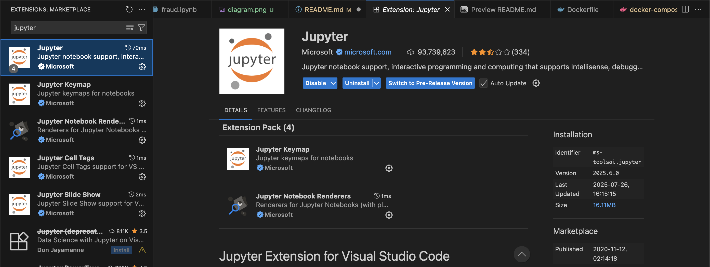
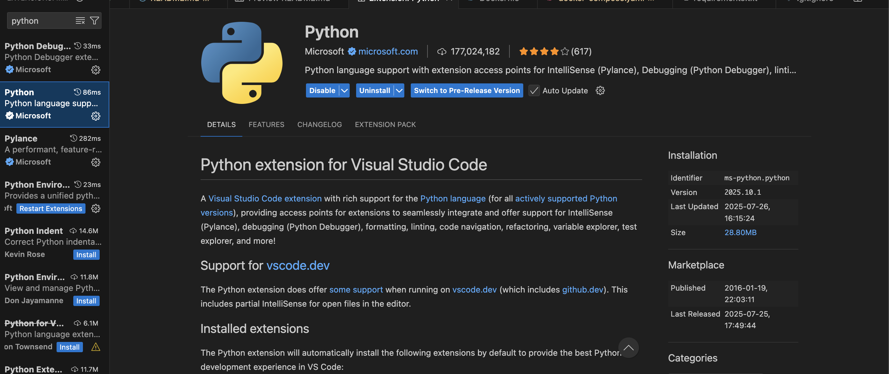
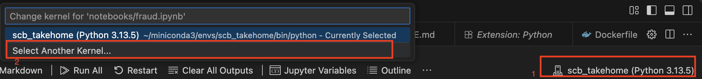
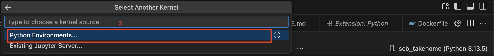
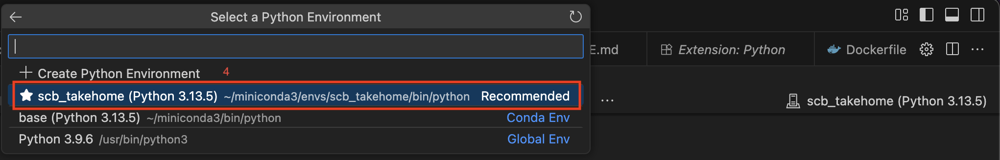
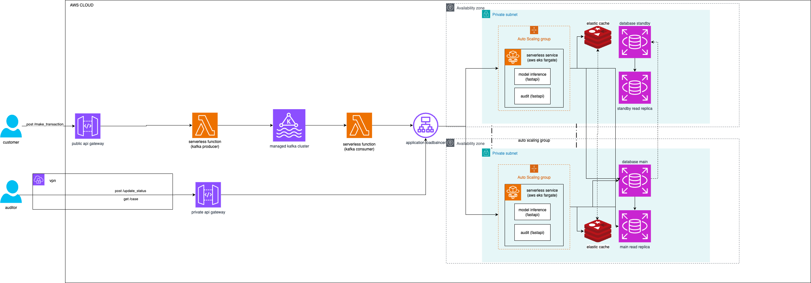

# SCB TAKE HOME ASSIGNMENT

This documentation has 3 sections including

- [Setup jupyter environment (EDA/Training)](#️setup-jupyter-environment-eda--training)
- [Run/Test model serving endpoint](#️run--test-model-serving-endpoint)
- [Architecture explanation](#️architecture-explanation)

## Setup jupyter environment (EDA/Training) 

### 1 Install Miniconda

- Follow instruction in [Miniconda official installation guide](https://www.anaconda.com/docs/getting-started/miniconda/install#macos)

### 2 create conda environment
```
conda create --name scb_takehome --clone base
conda activate scb_takehome
```

### 3 install dependencies
```
pip install -r notebooks/requirements-notebooks.txt
```

### 4 install VS Code
- Download VS Code that is compatible with your machine at its [official site](https://code.visualstudio.com/download)
- install jupyter extension
<br>
- install python extension<br>
<br>
- open fraud.ipynb then select scb_takehome as a kernel for jupyter notebook<br>
<br>
<br>
<br>

### 5 Load data
- Create data directory in notebooks directory
- Download fraud_mock.csv into that directory
- After that you can now run fraud.ipynb

## Run/Test model serving

### 1 create database directory
- Create db directory in app directory

### 2 Install docker desktop
- Get docker desktop from [official website](https://docs.docker.com/get-started/introduction/get-docker-desktop/)
- Open downloaded file
- Launch docker desktop

### 3 Build docker image and run docker container
```
docker compose up --build
```

### 4 test endpoint
- use this command to get positive prediction
```
curl -X 'POST' \
  'http://localhost:8000/predict' \
  -H 'accept: application/json' \
  -H 'Content-Type: application/json' \
  -d '{
  "amount": 181.0,
  "src_bal": 181.0,
  "dst_bal": 0.0,
  "transac_type": "TRANSFER"
}'
```
- use this command to get negative prediction
```
curl -X 'POST' \
  'http://localhost:8000/predict' \
  -H 'accept: application/json' \
  -H 'Content-Type: application/json' \
  -d '{
  "amount": 181.0,
  "src_bal": 181.0,
  "dst_bal": 0.0,
  "transac_type": "PAYMENT"
}'
```
- use this command to get every fraud transaction
```
curl -X 'GET' \
  'http://localhost:8000/frauds' \
  -H 'accept: application/json'
```

## Architecture explanation

There are 2 flows in this diagram
- user flow
- auditor flow

### 1 User flow

In this flow user start making post request at /make_transaction endpoint through application/web. Then the request will be sent to public <br>api gateway. Public api gateway will trigger serverless function (Producer) to send the required features into managed kafka cluster.<br>The broker in kafka cluster will send message to another serverless function (Consumer). As they are serverless scalability and <br>reliability are managed by cloud provider. After consumer receive input features it will send request to application loadbalancer <br>which connects to auto scaling group that span across two availability zones. The autoscaling group is managed by container <br>orchestrator service. Each of our service will be deploy on serverless instance for simplicity. After the service predict transactions <br>it will record the result in the database which also span across different availability zone to increase availability.

### 2 Auditor flow
In this flow the auditor making contact with the private api gateway via vpn. Then the api gateway will forward the request to application load balancer which will distribute traffic between availability zones. For get /case endpoint, the service will try to read data from cache first then if it can't find the data in case it will start searching in read replica. On the other hand for post /update_status the service will update new status of the transaction on the main database.